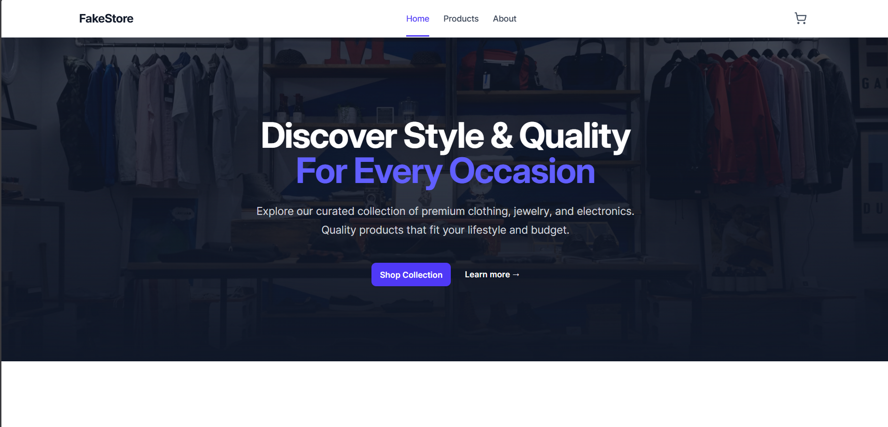
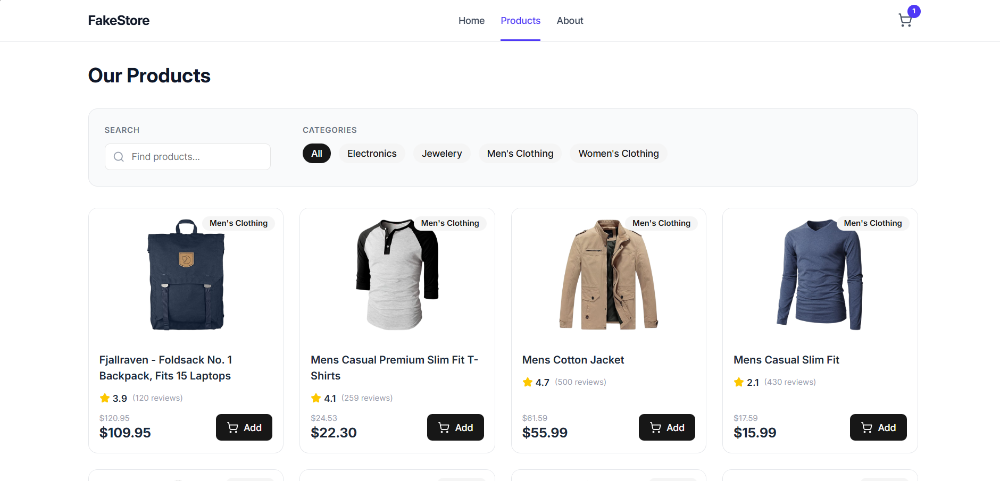
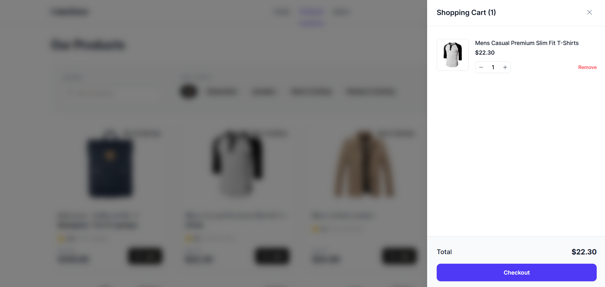

# Fake Store Web


Uma aplicação moderna de e-commerce construída com React 19, React Router v7 e Redux Toolkit. Este projeto simula uma loja virtual completa, consumindo a [Fake Store API](https://fakestoreapi.com/) para exibir produtos, categorias e gerenciar um carrinho de compras.

> 📱 **Totalmente Responsivo:** A interface foi cuidadosamente projetada para oferecer a melhor experiência de usuário em qualquer dispositivo, seja mobile, tablet ou desktop.

🔗 **Demo:** [fake-store-web-nu.vercel.ap](fake-store-web-nu.vercel.ap)

## 📸 Screenshots

| Home Page | Product List |
|:---:|:---:|
|  |  |
| *Página inicial com Hero e Categorias* | *Listagem com filtros e busca* |

| Product Details | Shopping Cart |
|:---:|:---:|
|  |  |
| *Detalhes do produto e opções* | *Carrinho lateral (Drawer)* |

## 🎥 Video Demo

<video controls src="./public/prints/video-demo.mp4" title="Video Demo"></video>

> ℹ️ **Nota:** Se o vídeo não reproduzir, você pode [baixá-lo aqui](./public/prints/video-demo.mp4).


## 🚀 Tecnologias

Este projeto foi desenvolvido utilizando as tecnologias mais recentes do ecossistema React:

- **Framework & Routing:** [React Router v7](https://reactrouter.com/) (anteriormente Remix/React Router Data API)
- **UI Library:** [React 19](https://react.dev/)
- **Gerenciamento de Estado:**
  - [Redux Toolkit](https://redux-toolkit.js.org/) (Slices, Store)
  - [Redux Saga](https://redux-saga.js.org/) (Side effects, Data fetching)
  - **Redux Persist** (Persistência do carrinho no LocalStorage)
- **Estilização:**
  - [Tailwind CSS v4](https://tailwindcss.com/)
  - Componentes estilizados com variantes personalizadas
- **Ícones:** [Lucide React](https://lucide.dev/)
- **HTTP Client:** [Axios](https://axios-http.com/)
- **Build Tool:** [Vite](https://vitejs.dev/)

## ✨ Funcionalidades

- **Home Page Imersiva:** Hero section e grid de categorias interativo.
- **Catálogo de Produtos:** Listagem com filtros por categoria e busca com *debounce* para performance.
- **Detalhes do Produto:** Página dedicada com informações completas, avaliações e seleção de variantes.
- **Carrinho de Compras:**
  - Drawer lateral (Side Modal) acessível de qualquer página.
  - Adicionar, remover e atualizar quantidades.
  - Persistência de estado (durante a navegação).
- **Checkout Flow:** Simulação de finalização de compra com página de sucesso.
- **Design Responsivo:** Layout totalmente adaptável para mobile, tablet e desktop.
- **Arquitetura Escalável:**
  - Estrutura baseada em *Features* (pages/components).
  - Componentes UI reutilizáveis (`ui/Button`, `ui/Badge`, etc.).
  - Separação clara de lógica de negócio (Sagas/Slices) e UI.

## 📂 Estrutura do Projeto

```bash
app/
├── components/
│   ├── cart/         # Componentes do Carrinho (Drawer, Item)
│   ├── layout/       # Layouts globais (Header, Root)
│   └── ui/           # Componentes base (Button, Input, Badge...)
├── pages/
│   ├── about/        # Página Sobre
│   ├── checkout/     # Página de Checkout
│   ├── home/         # Página Inicial
│   └── products/     # Páginas de Produtos (Listagem, Detalhes)
├── services/         # Integração com API (Axios)
├── shared/           # Tipos, Helpers, Constantes
├── store/            # Configuração Redux (Sagas, Slices)
└── routes.ts         # Definição de rotas (React Router v7)
```

🔗 **Link do Deploy:** [fake-store-web-nu.vercel.ap](fake-store-web-nu.vercel.ap)

## ��️ Como Executar Localmente

1. **Clone o repositório**
   ```bash
   git clone https://github.com/seu-usuario/fake-store-web.git
   cd fake-store-web
   ```

2. **Instale as dependências**
   ```bash
   npm install
   ```

3. **Execute o servidor de desenvolvimento**
   ```bash
   npm run dev
   ```

4. **Abra no navegador**
   Acesse `http://localhost:5173` (ou a porta indicada no terminal).

---

Desenvolvido com 💙
